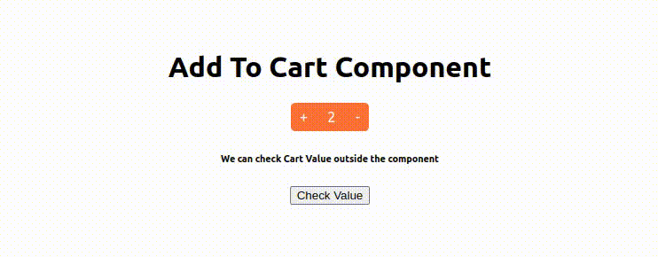

# Add To Cart React Component

Add to cart react component is a component to increase or decrease the cart quanity. Initially clicking on add to cart component will intialize to 1, then increase or decrease the quantity can be done, likewise decreasing the quantity from 1, will bring back the add to cart component. 

## Available Scripts

In the project directory, you can run:

### `npm start`

Runs the app in the development mode.\
Open [http://localhost:3000](http://localhost:3000) to view it in the browser.

The page will reload if you make edits.\
You will also see any lint errors in the console.

### `npm test`

Launches the test runner in the interactive watch mode.\
See the section about [running tests](https://facebook.github.io/create-react-app/docs/running-tests) for more information.

### `npm run build`

Builds the app for production to the `npm run clean && yarn build:esm && yarn build:cjs` folder.\
It correctly bundles React in production webpack mode and optimizes the build for the best performance.

The build is minified and the filenames include the hashes.\

## How to use

We can import the AddToCartComponent, initialize the add to cart props with minimum, maximum values and pass the reference for the cart component. Pass the props to add to cart component and to get the value of the cart component using the reference passed in props.

    `import { AddToCartComponent }  from "addtocart-react-component";
    ..
    const cartProps = {
        title: "AddToCart",
        maxVal: 10,
        minVal: 0,
        initialVal: 2,
        color: "#eb5e28ca", //button color can be passed as props..
        ref: cartCountRef,
    };
    const checkVal = (e) => {
        e.preventDefault();
        console.log("check val", cartCountRef.current.outerText, cartCountRef);
        setShowval(cartCountRef.current.outerText);
    };

    <h1>Add To Cart Component</h1>
    <AddToCartComponent cartBtnProps={cartProps}/>
    <h6>We can check Cart Value outside the component</h6>
    <button onClick={checkVal}>Check Value</button>
    
{showval}
`

Please check the below demo video.
    

## Learn More

You can learn more in the [Create React App documentation](https://facebook.github.io/create-react-app/docs/getting-started).

To learn React, check out the [React documentation](https://reactjs.org/).
